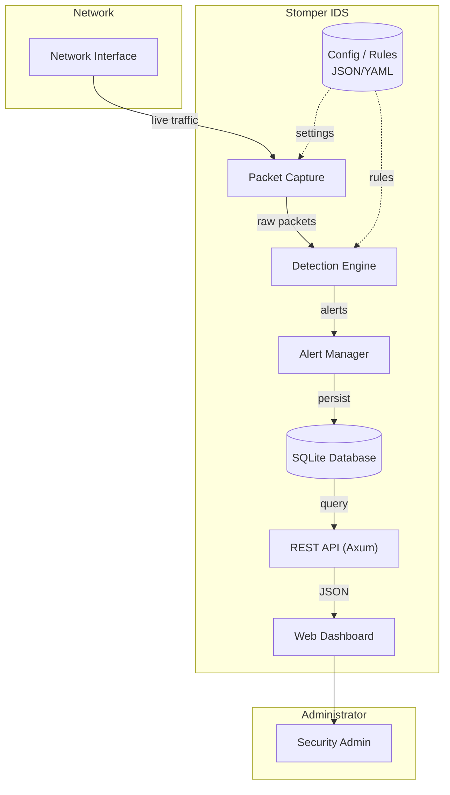
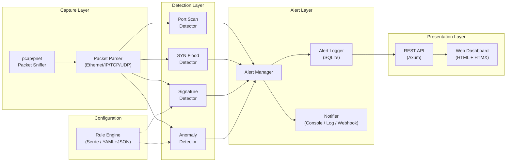
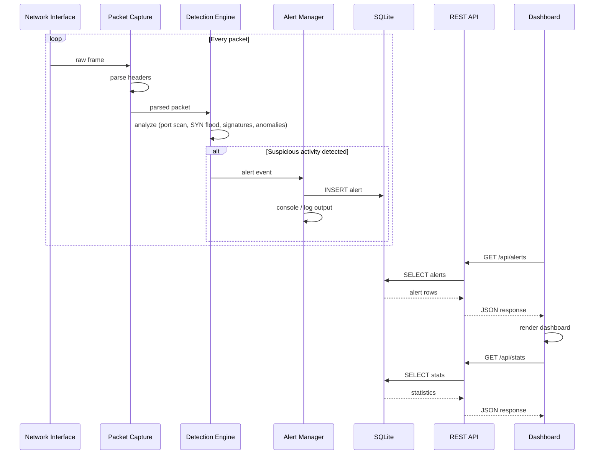

# Stomper Architecture

## Overview

Stomper is a network intrusion detection system (IDS) written in Rust. It captures live traffic, detects suspicious activity (port scans, SYN floods, signature matches, anomalies), and surfaces alerts through a web dashboard.

The system follows a **modular pipeline architecture** with independent components connected via channels and a shared database. Each component can be developed, tested, and scaled independently.

---

## High-Level Architecture



---

## Component Architecture



---

## Data Flow



---

## Module Structure

```
src/
├── main.rs                 # Entry point, wires components together
├── capture/                # Packet capture & parsing
│   ├── mod.rs
│   ├── sniffer.rs          # pcap/pnet interface binding
│   └── parser.rs           # Ethernet/IP/TCP/UDP header parsing
├── detection/              # Intrusion detection engine
│   ├── mod.rs
│   ├── port_scan.rs        # Port scan detection logic
│   ├── syn_flood.rs        # SYN flood detection logic
│   ├── signature.rs        # Signature-based matching
│   └── anomaly.rs          # Behavioral / statistical anomalies
├── alert/                  # Alert management
│   ├── mod.rs
│   ├── manager.rs          # Alert lifecycle, dedup, throttling
│   ├── storage.rs          # SQLite read/write via rusqlite/sqlx
│   └── notifier.rs         # Console, log file, webhook/email sinks
├── api/                    # REST API & dashboard
│   ├── mod.rs
│   ├── routes.rs           # Axum route handlers
│   ├── dashboard.rs        # Dashboard HTML rendering
│   └── response.rs         # JSON response types
├── config/                 # Configuration & rules
│   ├── mod.rs
│   ├── settings.rs         # App-wide configuration
│   └── rules.rs            # Rule parsing (Serde, YAML/JSON)
└── db/                     # Database layer
    ├── mod.rs
    ├── migrations.rs       # Schema setup
    └── models.rs           # Row types
```

---

## Technology Stack

| Layer | Technology | Purpose |
|-------|-----------|---------|
| Language | Rust (edition 2024) | Memory-safe systems programming |
| Packet Capture | `pcap` / `pnet` | Live network interface binding and packet parsing |
| Async Runtime | `Tokio` | Concurrent non-blocking packet processing |
| Web Framework | `Axum` | REST API and HTTP dashboard server |
| Database | `SQLite` via `rusqlite` / `sqlx` | Persistent alert and event storage |
| Serialization | `Serde` | JSON/YAML config and rule file parsing |
| Dashboard | HTML + HTMX | Lightweight web UI (no heavy JS framework) |
| Testing | Built-in `#[test]` | Unit and integration tests |

---

## Key Design Decisions

- **Pipeline concurrency**: The capture, detection, and alert stages run on separate Tokio tasks connected by channels. This prevents backpressure from dropping packets when analysis is slow.
- **Open/Closed Principle**: New detection modules (e.g., brute-force, DNS tunneling) can be added without modifying existing code — each implements a common `Detector` trait.
- **Configuration hot-reload**: Rule files are watched for changes and reloaded without restarting the process, allowing live tuning.
- **SQLite for simplicity**: A serverless database avoids operational overhead while supporting structured alert queries for the dashboard.
