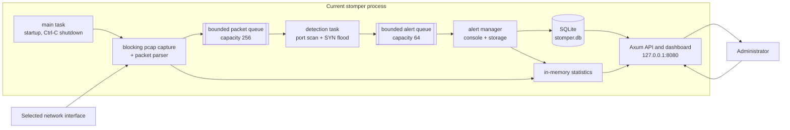
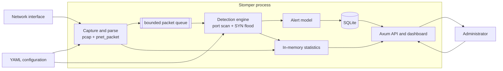

# Stomper Architecture

This document separates the current prototype from the intended IDS. Source
code and `Cargo.toml` determine what is implemented.

## Status legend

| Status | Meaning |
|---|---|
| **Implemented** | Compiled and usable in the current program |
| **Partial** | Useful code exists, but the planned capability is incomplete |
| **Scaffold** | Placeholder file only; not compiled and has no behavior |
| **Planned** | Required for the target architecture but not implemented |
| **Deferred** | Optional enhancement outside the current target |

## Scope

Stomper is a network intrusion detection system (IDS). The target is one Rust
process that:

- captures traffic from a selected network interface;
- parses common Ethernet, IP, TCP, UDP, and ICMP headers;
- detects port scans and SYN floods;
- creates and stores alerts in SQLite; and
- presents alert history, traffic statistics, and system status through a small
  local web dashboard.

The following are outside the core scope:

- blocking or modifying network traffic;
- full packet recording, TCP stream reconstruction, or protocol decoding;
- remote multi-user administration;
- machine-learning anomaly detection; and
- guaranteed zero packet loss.

## Requirements traceability

| Plan requirement | Priority | Owning module | Current state |
|---|---|---|---|
| Select an interface and capture live traffic | Core | `capture` and `config` | **Partial** - capture works, selection is automatic |
| Parse Ethernet/IP/TCP/UDP headers | Core | `capture::parser` | **Partial** - common headers are parsed with known limitations |
| Detect port scans | Core | `detection` | **Implemented** - fixed thresholds |
| Detect SYN floods | Core | `detection` | **Implemented** - fixed thresholds |
| Generate and store alerts | Core | `alert` and `db` | **Implemented** |
| Show alert history and details | Core | `db` and `api` | **Implemented** |
| Show traffic statistics and system status | Core | `api` and `stats` | **Implemented** |
| Signature matching | Enhancement | `detection` | **Deferred** |
| Configurable JSON/YAML detection rules | Enhancement | `config` and `detection` | **Deferred** |
| Email/webhook notifications | Enhancement | `alert` | **Deferred** |

## Current architecture

```mermaid
flowchart LR
    NIC["Selected network interface"]
    ADMIN["Administrator"]

    subgraph APP["Current stomper process"]
        MAIN["main task<br/>startup, Ctrl-C shutdown"]
        PCAP["blocking pcap capture<br/>+ packet parser"]
        QUEUE[["bounded packet queue<br/>capacity 256"]]
        DETECT["detection task<br/>port scan + SYN flood"]
        AQUEUE[["bounded alert queue<br/>capacity 64"]]
        ALERT["alert manager<br/>console + storage"]
        DB[("SQLite<br/>stomper.db")]
        STATS["in-memory statistics"]
        WEB["Axum API and dashboard<br/>127.0.0.1:8080"]
    end

    NIC --> PCAP
    MAIN --> PCAP
    PCAP --> QUEUE
    PCAP --> STATS
    QUEUE --> DETECT
    DETECT --> AQUEUE
    AQUEUE --> ALERT
    ALERT --> DB
    ALERT --> STATS
    DB --> WEB
    STATS --> WEB
    ADMIN --> WEB
    WEB --> ADMIN
```

Current behavior:

1. List capture devices and select the first whose name does not start with
   `lo`, or fall back to the first device.
2. Open the SQLite database, creating it if missing, and start the alert manager
   and the dashboard before capture, so the first alert already has somewhere to
   go.
3. Open a promiscuous `pcap` capture with a 65,535-byte snap length and a
   1,000-ms read timeout, and read and parse packets in a Tokio blocking task.
4. Send `ParsedPacket` values through a bounded channel of 256 items. When that
   queue is full, the newest packet is dropped and `packets_dropped_queue_full`
   is incremented.
5. Run both detectors, in order, on one detection task, and print a summary line
   per packet.
6. Convert each detection into an `Alert`, store it, and print the console alert
   block.
7. Serve alert history and statistics until Ctrl-C, then stop capture, drain the
   packet queue, finish pending inserts, and stop the server.

Differences from the target architecture below: the interface is still chosen
automatically rather than from configuration, `config` is still a scaffold, and
application logs are `println!`/`eprintln!` rather than structured `tracing`.

## Target architecture

```mermaid
flowchart LR
    NIC["Network interface"]
    ADMIN["Administrator"]
    CONFIG["YAML configuration"]

    subgraph APP["Stomper process"]
        CAPTURE["Capture and parse<br/>pcap + pnet_packet"]
        QUEUE[["bounded packet queue"]]
        DETECT["Detection engine<br/>port scan + SYN flood"]
        ALERT["Alert model"]
        DB[("SQLite")]
        STATS["In-memory statistics"]
        WEB["Axum API and dashboard"]
    end

    NIC --> CAPTURE
    CONFIG --> CAPTURE
    CONFIG --> DETECT
    CAPTURE --> QUEUE
    CAPTURE --> STATS
    QUEUE --> DETECT
    DETECT --> ALERT
    ALERT --> DB
    DETECT --> STATS
    DB --> WEB
    STATS --> WEB
    ADMIN --> WEB
    WEB --> ADMIN
```

The flow is:

1. `main` loads and validates configuration, initializes SQLite, starts the web
   server, and starts capture.
2. The capture worker reads and parses frames.
3. Parsed packets enter one bounded queue.
4. One detection task runs the port-scan and SYN-flood detectors in order.
5. A detection becomes an `Alert`, which is printed and inserted into SQLite.
6. The Axum server reads alerts from SQLite and statistics from shared
   in-memory counters.

## Component responsibilities

| Module | Target responsibility | Status |
|---|---|---|
| `main.rs` | Startup, shutdown, task wiring, and Ctrl-C handling | **Implemented** |
| `capture` | Interface access, packet capture, parsing, and capture errors | **Partial** |
| `detection` | State windows, port-scan and SYN-flood logic, alert evidence | **Implemented** |
| `alert` | Alert data type, severity, evidence, console formatting, manager task | **Implemented** |
| `db` | SQLite schema, migrations, inserts, and alert queries | **Implemented** |
| `api` | Axum routes, dashboard HTML, and JSON responses | **Implemented** |
| `stats` | Shared in-memory traffic counters | **Implemented** |
| `config` | YAML loading and validation | **Scaffold** |

The alert path is one direction only: detection produces an `Activity`, `alert`
turns it into an `Alert`, and the alert manager task is the single writer to
SQLite. `db` never calls `detection`, and `api` only reads.

The HTTP surface is:

| Route | Response |
|---|---|
| `GET /` | Dashboard HTML: statistics cards and the recent alert table |
| `GET /api/alerts?limit=N` | Recent alerts as JSON, newest first |
| `GET /api/alerts/{id}` | One alert, or 404 |
| `GET /api/stats` | Traffic counters plus alert counts by severity |
| `GET /api/status` | Health flag and the same runtime counters |

The target dependency set contains only libraries used by the planned runtime:

| Need | Library |
|---|---|
| Capture | Existing `pcap` |
| Packet parsing | Existing `pnet_packet` |
| Async runtime and channels | Existing Tokio |
| Typed errors | Existing `thiserror` |
| JSON responses | Existing Serde |
| Timestamps | Existing `chrono` |
| SQLite | Existing `sqlx` with SQLite support |
| Web dashboard/API | Existing Axum |
| YAML configuration | A YAML parser, once `config` is implemented |
| Structured application logs | `tracing` and `tracing-subscriber` |

## Runtime and resource policy

- One blocking capture worker owns the synchronous `pcap` handle.
- One detection task preserves packet order for stateful detectors.
- One configurable bounded queue connects capture to detection.
- A full queue drops the newest parsed packet and increments
  `packets_dropped_queue_full`, keeping overload visible and memory bounded.
- The detection task stores alerts through the async SQLite module; alert volume
  is expected to remain much lower than packet volume.
- Traffic statistics remain in memory for the current run; only alerts are
  persisted.
- Ctrl-C signals the capture worker, closes the queue, drains queued packets,
  completes pending alert inserts, and stops the web server.

## Deployment and security

The initial deployment is a developer or lab machine with one executable and
one SQLite file.

- Traffic capture is limited to networks the operator is authorized to monitor.
- Deployment documentation covers Linux libpcap permissions and Windows Npcap
  requirements.
- The process uses the minimum capture privileges available on the platform.
- The dashboard binds to `127.0.0.1`; remote access, authentication, and TLS are
  outside the target architecture.
- Stored alerts contain no packet payload.
- IP addresses, MAC addresses, ports, and alert evidence are treated as
  sensitive operational data.
- SQL is parameterized and dashboard output is HTML-escaped.
- Operator-controlled locations hold the database and configuration files.

## Verification strategy

Verification includes:

- parser unit tests for supported and malformed headers - **present**;
- detector tests for thresholds, time-window expiry, and state limits -
  **present for SYN flood**, missing for port scan;
- SQLite tests using an in-memory database - **present**;
- alert tests for severity mapping, console format, and the manager task -
  **present**;
- API tests over real HTTP for alert lists, alert details, statistics, and
  status - **present**;
- saved-PCAP replay tests that do not require capture privileges - **missing**;
- one end-to-end replay that produces expected stored alerts - **missing**; and
- CI checks for formatting, compilation, tests, and linting on each declared
  supported operating system - **missing**.

No test needs capture privileges or writes a file, so `cargo test` is the whole
suite.

Performance tests verify bounded memory and reported queue drops when replay
exceeds processing capacity. `/api/status` counters and structured logs provide
the required runtime visibility.

## Delivery sequence

1. **Stabilize capture:** clean shutdown and loss counters are done. Windows
   timestamp conversion (ISSUE-001) and explicit interface selection remain.
2. **Add detection:** done. Port-scan tests and replay fixtures remain.
3. **Add alert storage:** done. See
   [the database document](database.md).
4. **Add reporting:** done. The dashboard and the alert, statistics, and status
   views are served on `127.0.0.1:8080`.
5. **Polish:** documentation, cross-platform verification, performance tuning,
   demonstration fixtures, and user guide.

Remaining gaps, in the order they block the plan: `config` (thresholds, bind
address, database path, and interface are compile-time constants today),
structured logging, PCAP replay fixtures, and CI.

Signatures, custom rule files, hot reload, anomaly detection, and external
notifications remain deferred until these phases are complete.

## Maintenance rule

This document changes with component status, core requirements, or runtime data
flow. Speculative features remain in the deferred list.
