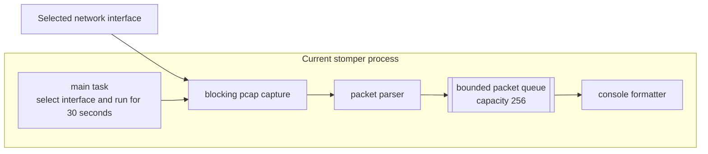
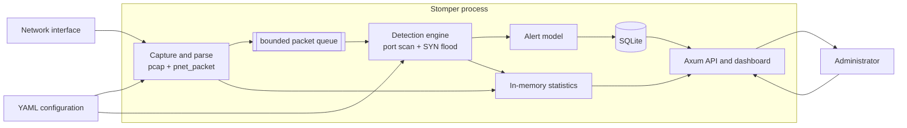

# Stomper Architecture

This document separates the current prototype from the intended IDS. Source
code and `Cargo.toml` determine what is implemented.

## Status legend

| Status | Meaning |
|---|---|
| **Implemented** | Compiled and usable in the current program |
| **Partial** | Useful code exists, but the planned capability is incomplete |
| **Scaffold** | Placeholder file only; not compiled and has no behavior |
| **Planned** | Required for the target architecture but not implemented |
| **Deferred** | Optional enhancement outside the current target |

## Scope

Stomper is a network intrusion detection system (IDS). The target is one Rust
process that:

- captures traffic from a selected network interface;
- parses common Ethernet, IP, TCP, UDP, and ICMP headers;
- detects port scans and SYN floods;
- creates and stores alerts in SQLite; and
- presents alert history, traffic statistics, and system status through a small
  local web dashboard.

The following are outside the core scope:

- blocking or modifying network traffic;
- full packet recording, TCP stream reconstruction, or protocol decoding;
- remote multi-user administration;
- machine-learning anomaly detection; and
- guaranteed zero packet loss.

## Requirements traceability

| Plan requirement | Priority | Owning module | Current state |
|---|---|---|---|
| Select an interface and capture live traffic | Core | `capture` and `config` | **Partial** - capture works, selection is automatic |
| Parse Ethernet/IP/TCP/UDP headers | Core | `capture::parser` | **Partial** - common headers are parsed with known limitations |
| Detect port scans | Core | `detection` | **Planned** |
| Detect SYN floods | Core | `detection` | **Planned** |
| Generate and store alerts | Core | `alert` and `db` | **Scaffold** |
| Show alert history and details | Core | `db` and `api` | **Planned** |
| Show traffic statistics and system status | Core | `api` | **Planned** |
| Signature matching | Enhancement | `detection` | **Deferred** |
| Configurable JSON/YAML detection rules | Enhancement | `config` and `detection` | **Deferred** |
| Email/webhook notifications | Enhancement | `alert` | **Deferred** |

## Current architecture

```mermaid
flowchart LR
    NIC["Selected network interface"]

    subgraph APP["Current stomper process"]
        MAIN["main task<br/>select interface and run for 30 seconds"]
        PCAP["blocking pcap capture"]
        PARSER["packet parser"]
        QUEUE[["bounded packet queue<br/>capacity 256"]]
        CONSOLE["console formatter"]
    end

    NIC --> PCAP
    MAIN --> PCAP
    PCAP --> PARSER
    PARSER --> QUEUE
    QUEUE --> CONSOLE
```

Current behavior:

1. List capture devices.
2. Select the first device whose name does not start with `lo`, or fall back to
   the first device.
3. Open a promiscuous `pcap` capture with a 65,535-byte snap length and a
   1,000-ms read timeout.
4. Read and parse packets in a Tokio blocking task.
5. Send `ParsedPacket` values through a bounded channel of 256 items.
6. Print packet summaries until the 30-second timer expires.

## Target architecture

```mermaid
flowchart LR
    NIC["Network interface"]
    ADMIN["Administrator"]
    CONFIG["YAML configuration"]

    subgraph APP["Stomper process"]
        CAPTURE["Capture and parse<br/>pcap + pnet_packet"]
        QUEUE[["bounded packet queue"]]
        DETECT["Detection engine<br/>port scan + SYN flood"]
        ALERT["Alert model"]
        DB[("SQLite")]
        STATS["In-memory statistics"]
        WEB["Axum API and dashboard"]
    end

    NIC --> CAPTURE
    CONFIG --> CAPTURE
    CONFIG --> DETECT
    CAPTURE --> QUEUE
    CAPTURE --> STATS
    QUEUE --> DETECT
    DETECT --> ALERT
    ALERT --> DB
    DETECT --> STATS
    DB --> WEB
    STATS --> WEB
    ADMIN --> WEB
    WEB --> ADMIN
```

The flow is:

1. `main` loads and validates configuration, initializes SQLite, starts the web
   server, and starts capture.
2. The capture worker reads and parses frames.
3. Parsed packets enter one bounded queue.
4. One detection task runs the port-scan and SYN-flood detectors in order.
5. A detection becomes an `Alert`, which is printed and inserted into SQLite.
6. The Axum server reads alerts from SQLite and statistics from shared
   in-memory counters.

## Component responsibilities

| Module | Target responsibility | Status |
|---|---|---|
| `main.rs` | Startup, shutdown, task wiring, and Ctrl-C handling | **Partial** |
| `capture` | Interface access, packet capture, parsing, and capture errors | **Partial** |
| `detection` | Detector trait, state windows, port-scan and SYN-flood logic | **Scaffold** |
| `alert` | Alert data type, severity, evidence, and console formatting | **Scaffold** |
| `db` | SQLite schema, migrations, inserts, and alert queries | **Scaffold** |
| `api` | Axum routes, dashboard HTML, and JSON responses | **Scaffold** |
| `config` | YAML loading and validation | **Scaffold** |

The target dependency set contains only libraries used by the planned runtime:

| Need | Library |
|---|---|
| Capture | Existing `pcap` |
| Packet parsing | Existing `pnet_packet` |
| Async runtime and channels | Existing Tokio |
| Typed errors | Existing `thiserror` |
| Configuration and JSON | Serde plus a YAML parser |
| SQLite | `sqlx` with SQLite support |
| Web dashboard/API | Axum |
| Structured application logs | `tracing` and `tracing-subscriber` |

## Runtime and resource policy

- One blocking capture worker owns the synchronous `pcap` handle.
- One detection task preserves packet order for stateful detectors.
- One configurable bounded queue connects capture to detection.
- A full queue drops the newest parsed packet and increments
  `packets_dropped_queue_full`, keeping overload visible and memory bounded.
- The detection task stores alerts through the async SQLite module; alert volume
  is expected to remain much lower than packet volume.
- Traffic statistics remain in memory for the current run; only alerts are
  persisted.
- Ctrl-C signals the capture worker, closes the queue, drains queued packets,
  completes pending alert inserts, and stops the web server.

## Deployment and security

The initial deployment is a developer or lab machine with one executable and
one SQLite file.

- Traffic capture is limited to networks the operator is authorized to monitor.
- Deployment documentation covers Linux libpcap permissions and Windows Npcap
  requirements.
- The process uses the minimum capture privileges available on the platform.
- The dashboard binds to `127.0.0.1`; remote access, authentication, and TLS are
  outside the target architecture.
- Stored alerts contain no packet payload.
- IP addresses, MAC addresses, ports, and alert evidence are treated as
  sensitive operational data.
- SQL is parameterized and dashboard output is HTML-escaped.
- Operator-controlled locations hold the database and configuration files.

## Verification strategy

Verification includes:

- parser unit tests for supported and malformed headers;
- saved-PCAP replay tests that do not require capture privileges;
- detector tests for thresholds, time-window expiry, and state limits;
- SQLite tests using a temporary database;
- API tests for alert lists, alert details, statistics, and status;
- one end-to-end replay that produces expected stored alerts; and
- CI checks for formatting, compilation, tests, and linting on each declared
  supported operating system.

Performance tests verify bounded memory and reported queue drops when replay
exceeds processing capacity. `/api/status` counters and structured logs provide
the required runtime visibility.

## Delivery sequence

1. **Stabilize capture:** fix Windows timestamp conversion, add explicit
   interface selection, clean shutdown, structured errors, and loss counters.
2. **Add detection:** implement and replay-test port-scan and SYN-flood
   detectors with bounded state.
3. **Add alert storage:** define `Alert`, add SQLite migrations, insert/query
   functions, and console alerts.
4. **Add reporting:** implement the Axum dashboard and the required alert,
   statistics, and status views.
5. **Polish:** documentation, cross-platform verification, performance tuning,
   demonstration fixtures, and user guide.

Signatures, custom rule files, hot reload, anomaly detection, and external
notifications remain deferred until these phases are complete.

## Maintenance rule

This document changes with component status, core requirements, or runtime data
flow. Speculative features remain in the deferred list.
