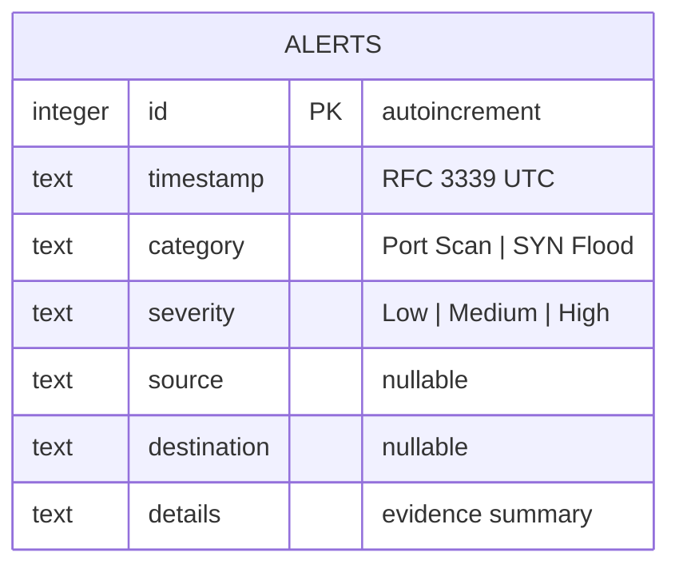

# Stomper Database

This document describes the SQLite database that stores Stomper alerts. The
implementation lives in `src/db/mod.rs`; the schema in that file is the source of
truth and this document explains it.

## Scope

The database stores **alerts only**. Everything else the system knows is either
transient or derivable:

| Data | Where it lives | Why |
|---|---|---|
| Alerts | SQLite, on disk | Must survive restarts for incident review |
| Traffic statistics | Memory (`src/stats.rs`) | Only meaningful for the current run |
| Parsed packets | Memory, one bounded queue | Volume is far too high to persist |
| Packet payloads | Nowhere | Out of scope, and sensitive |

One table is enough. Alerts are written once and never updated, there are no
foreign keys, and every dashboard view is a filter over the same rows.

## Model



## Schema

```sql
CREATE TABLE IF NOT EXISTS alerts (
    id          INTEGER PRIMARY KEY AUTOINCREMENT,
    timestamp   TEXT    NOT NULL,
    category    TEXT    NOT NULL,
    severity    TEXT    NOT NULL,
    source      TEXT,
    destination TEXT,
    details     TEXT    NOT NULL
);

CREATE INDEX IF NOT EXISTS idx_alerts_timestamp ON alerts (timestamp);
```

| Column | Meaning | Example |
|---|---|---|
| `id` | Row identity, and insertion order | `42` |
| `timestamp` | Capture time of the packet that triggered detection, RFC 3339 UTC | `2026-07-30T10:35:14+00:00` |
| `category` | Attack name, from the `CATEGORY_*` constants in `src/alert/mod.rs` | `Port Scan` |
| `severity` | `Low`, `Medium`, or `High` | `Medium` |
| `source` | Attacking address when the detector can attribute one, otherwise `NULL` | `192.168.1.50` |
| `destination` | Targeted address when the detector can attribute one, otherwise `NULL` | `192.168.1.1:80` |
| `details` | Human-readable evidence: counts, ports, observed sources | `64 distinct destination sockets contacted; ports 22, 80, 443` |

Design notes:

- **Text timestamps.** RFC 3339 in UTC is readable in `sqlite3`, sorts
  correctly as text, and needs no conversion in the API responses. The alert
  carries the *packet* time, not the insert time, so replayed captures keep the
  timestamps the operator expects.
- **Text severity.** Storing `Medium` instead of `2` keeps dumps readable and
  keeps the enum definition in one place (`Severity` in `src/alert/mod.rs`). An
  unknown severity read back from an older or newer build is reported as
  `DbError::InvalidRow` rather than silently mapped.
- **Nullable addresses.** A single-source port scan has no single victim, and a
  SYN flood has no single attacker. `NULL` records that honestly instead of
  inventing a placeholder.
- **`details` is a sentence, not structured data.** Alert evidence is capped and
  summarised by the detectors (`MAX_EVIDENCE_ITEMS` in `src/detection/mod.rs`),
  so it renders directly on the dashboard. Anything that later needs querying
  gets its own column, not a parser over this field.
- **One index.** `id DESC` already answers "newest alerts" from the primary key.
  The `timestamp` index exists for time-range views of replayed captures, where
  insertion order and capture order can differ.

## Access

`AlertStore` is the only way in. It is cloneable and shares one connection pool.

| Method | Statement | Used by |
|---|---|---|
| `open(path)` | Applies the schema (`CREATE TABLE IF NOT EXISTS`) | `main` at startup |
| `insert(alert)` | `INSERT INTO alerts (...) VALUES (?, ?, ?, ?, ?, ?)` | Alert manager |
| `recent(limit)` | `SELECT ... ORDER BY id DESC LIMIT ?` | `GET /` and `GET /api/alerts` |
| `by_id(id)` | `SELECT ... WHERE id = ?` | `GET /api/alerts/{id}` |
| `summary()` | `SELECT severity, COUNT(*) ... GROUP BY severity` | `GET /` and `GET /api/stats` |

Rules the code follows:

- Every statement is a literal string with bound parameters. No SQL is built by
  string interpolation.
- `limit` is clamped to `MAX_QUERY_LIMIT` (500) inside the store, so a query
  string cannot ask for an unbounded result set.
- The pool holds **one** connection. Writes stay serialised, SQLite lock
  contention cannot happen, and tests get a stable in-memory database. Alert
  volume is orders of magnitude below packet volume, so this costs nothing.
- Storage failures are reported and skipped, never fatal: a database problem
  must not stop detection or suppress the console alert.

## Operations

- Default file: `stomper.db` in the working directory, created on first run. It
  is listed in `.gitignore`.
- The file holds operational data (addresses, ports, evidence). Keep it in an
  operator-controlled location with normal file permissions; there is no
  encryption and no access control beyond the filesystem.
- Backup and retention are manual. Copy the file, or delete rows with
  `DELETE FROM alerts WHERE timestamp < ...`. No automatic pruning exists yet.
- Inspect by hand with `sqlite3 stomper.db 'SELECT * FROM alerts ORDER BY id DESC LIMIT 10;'`.

## Migrations

`CREATE TABLE IF NOT EXISTS` runs on every startup and is the whole migration
step today. When a column has to change, add a numbered migration step next to
the schema rather than editing the existing statement, so existing databases
keep working.

## Testing

`src/db/mod.rs` tests run against `AlertStore::in_memory()`, so they need no
files and no privileges. They cover the round trip of a stored alert, newest-first
ordering with a limit, a missing row, and the severity summary. The alert-manager
test in `src/alert/mod.rs` and the HTTP test in `src/api/mod.rs` exercise the same
store through the real detection-to-dashboard path.
